# OCI – Compute Benchmark March 2026

## 1	OCI Compute Performance Analysis

**[This report](./OCI_Compute-Benchmark-March-2026)** provides a comprehensive comparative analysis of six Oracle Cloud Infrastructure compute shapes, focusing on the generational evolution of AMD EPYC processors, from Rome (E3) to the latest Turin (E6) architecture, alongside Intel Xeon Platinum (Ice Lake-SP)-based offerings.

The objective of this study is to support infrastructure and cloud architecture decision-making by establishing a clear correlation between underlying hardware characteristics (CPU architecture, frequency, and memory technology) and observed performance across standardized benchmark workloads.

The results highlight a strong and consistent performance progression across AMD EPYC generations. In particular, the VM.Standard.E6.Flex shape delivers a substantial leap in both single-core and multi-core performance, driven by higher boost frequencies, architectural optimizations, and the adoption of faster DDR5 memory.

While Intel-based shapes, especially those optimized for higher clock speeds, remain competitive in latency-sensitive and frequency-bound workloads, they are generally outperformed by AMD-based shapes in aggregate performance metrics. Most notably, AMD instances demonstrate a significantly superior price-to-performance ratio, making them the preferred choice for a wide range of general-purpose, compute-intensive, and scalable workloads.

Key takeaways:

- **VM.Standard.E6.Flex is the top-performing shape across nearly all benchmarks.** 
- **AMD EPYC generations show predictable and substantial performance scaling.**
- **Intel shapes remain relevant for specific high-frequency use cases, but at a higher cost.**
- **Cost efficiency strongly favors AMD-based shapes, particularly from E4 onward.**

## 2	Benchmark Scope and Methodology
All benchmarks were conducted under controlled and standardized conditions to ensure consistency, reproducibility, and fairness across all evaluated compute shapes.

### 2.1	Test Configuration

- ***Benchmark Tool:*** Geekbench 6.6.0 
- ***Compute Configuration:*** 18 OCPUs, 254 GB RAM (identical across all shapes) 
- ***Operating System:*** Ubuntu 24.04.4 LTS 
- ***Environment:*** Isolated execution environments to eliminate “noisy neighbor” effects and external resource contention 

### 2.2	Benchmark Design

The benchmark suite is designed to reflect both synthetic performance indicators and realistic workload scenarios encountered in enterprise environments. It includes:

- ***Single-core performance tests***
	- Designed to simulate latency-sensitive workloads such as transactional systems, web services, and front-end processing layers. 

- ***Multi-core performance tests***

	- Evaluating parallel execution efficiency for workloads such as batch processing, distributed systems, and high-performance computing (HPC). 

- ***Real-world workload simulations, including:***

	- 	Data compression and decompression 
	-  Code compilation (e.g., Clang) 
	-  Rendering and media processing 
	-  AI/ML inference tasks (e.g., object detection, image processing) 

This dual-layer approach ensures that the results provide both **theoretical performance insights** and **practical workload relevance**, enabling informed decisions aligned with real-world application requirements.

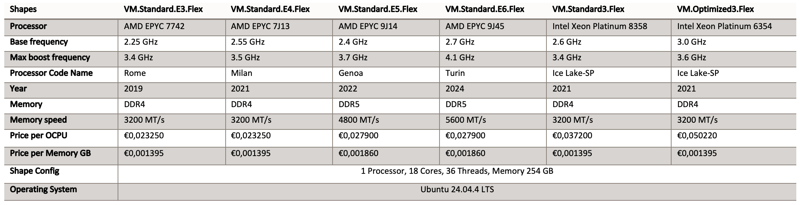

## 3	Single-Core Analysis

### 3.1	Shapes Performance

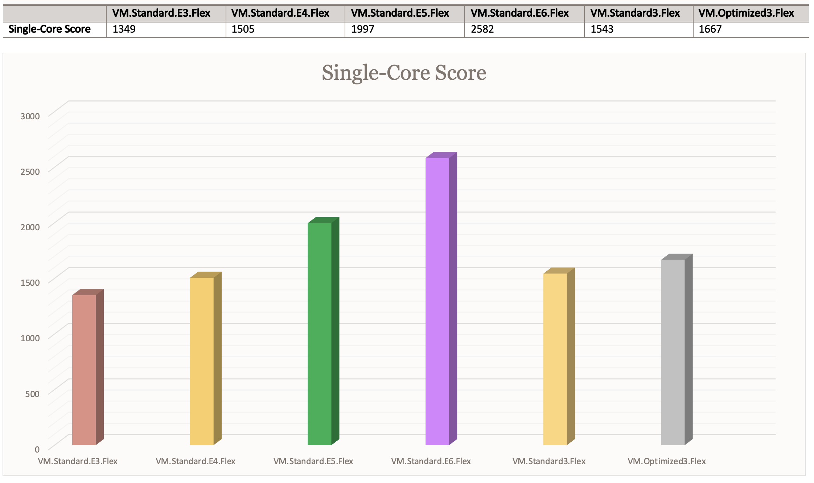

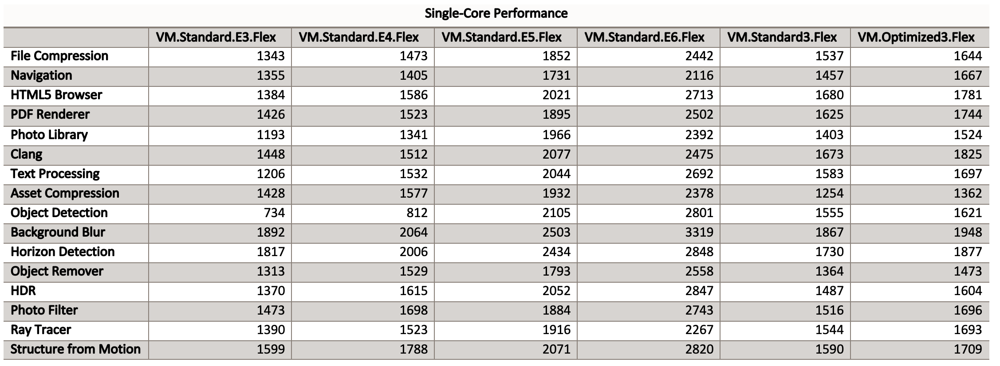

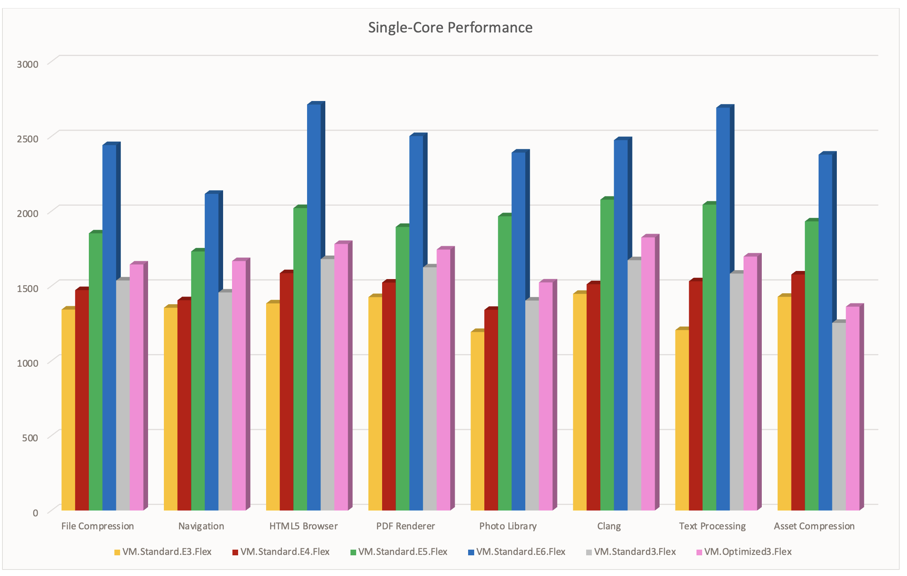

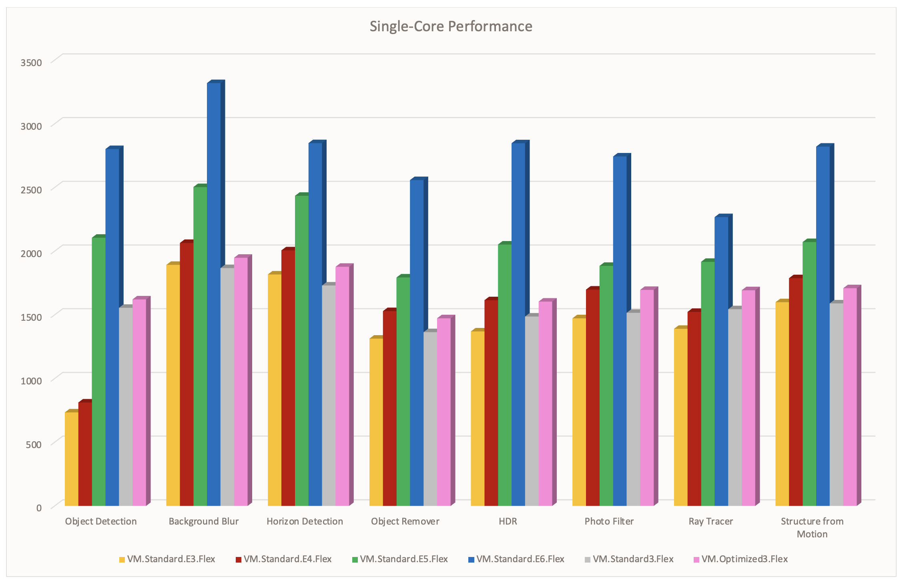

### 3.2	Single-Core Performance details

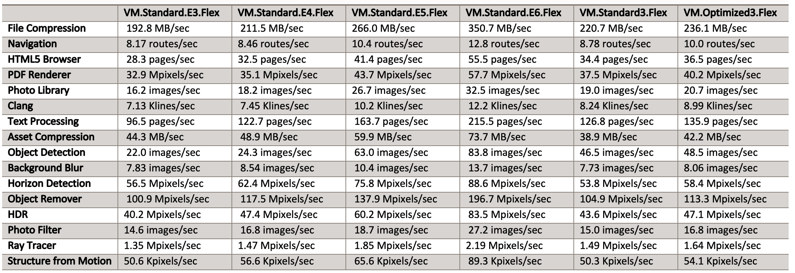

### 3.3	Single-Core Performance Analysis

Single-core performance exhibits a clear and consistent upward trend across AMD EPYC generations, culminating with the **VM.Standard.E6.Flex**, which achieves the highest score (2582). This represents an approximate **+29-30% improvement over E5** and nearly **+90% over E3**, highlighting the substantial architectural progress between generations.

A strong correlation is observed between **CPU boost frequency and single-threaded performance**, with E6 benefiting from frequencies up to **4.1 GHz,** combined with architectural enhancements introduced in the Turin generation. The transition to **DDR5 memory** further contributes to reduced latency and improved data throughput, reinforcing gains in real-world workloads.

While the** VM.Optimized3.Flex (Intel) **shape demonstrates solid performance due to its high base frequency, it remains consistently below E6 across all measured scenarios, indicating that frequency alone does not offset architectural and platform-level advantages.

**Key Performance Drivers**

- Higher boost frequencies (up to 4.1 GHz on E6) 
- Improved Instructions Per Cycle (IPC) across AMD generations 
- Transition from DDR4 to DDR5 memory (E5/E6) 
- Enhanced cache and microarchitectural optimizations

**Single-Core Workload Breakdown**

A detailed analysis of individual workloads reveals that performance gains are not uniform but are particularly pronounced in specific domains:

**AI and Image Processing Workloads**

The E6 generation delivers the most significant improvements in compute-intensive and vectorized tasks:

- **Object Detection:** up to **+300% vs E3,** reflecting major gains in SIMD/vector processing and memory bandwidth 
- **HDR Processing and Image Enhancement**: substantial improvements due to better parallel instruction handling even in single-thread contexts 

**Web and Front-End Workloads**

- **HTML5 Browser Rendering**: strong scaling with frequency and IPC improvements 
- Improved responsiveness in** web applications and client-side processing 

**General Compute and Data Processing**

- Noticeable gains in: 
	- File compression 
	- Text processing 
	- Asset compression

	These workloads benefit from both frequency scaling and cache/memory improvements. 

**Workload Implications**

The observed single-core performance characteristics make E6 particularly well-suited for:

- **Latency-sensitive applications** (APIs, microservices, real-time systems) 
- **Transactional databases** with high per-thread dependency 
- **Web servers and application front-ends** 
- **Lightweight AI inference workloads** executed in a non-parallelized context

The E6 generation does not only improve peak single-core performance but also **broadens the range of workloads that benefit from high per-thread efficiency**, reinforcing its position as the optimal choice for both modern cloud-native and traditional latency-sensitive applications.  

## 4	Multi-Core Analysis

### 4.1	Shapes Performance

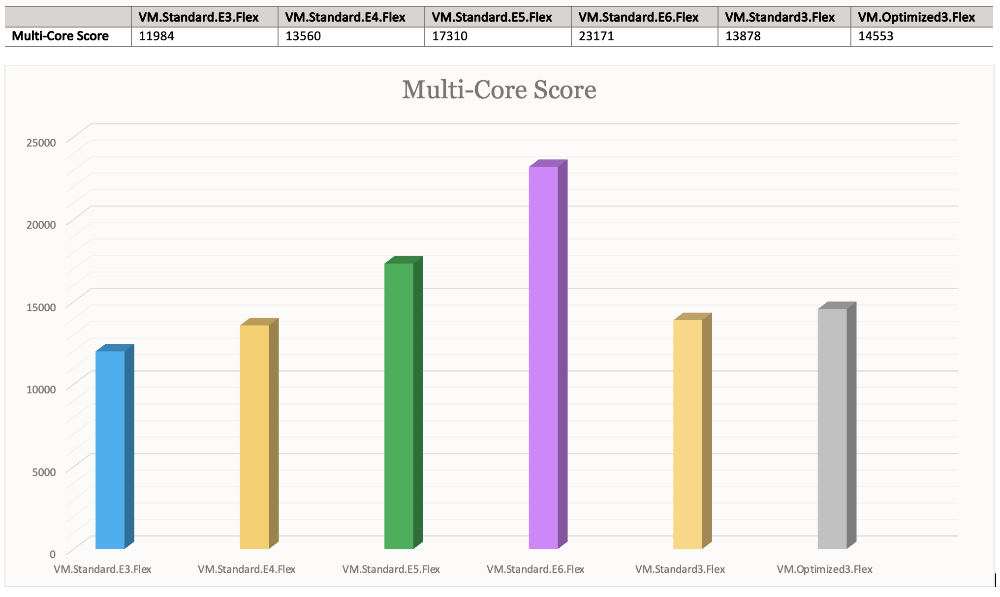

### 4.2	Multi-Core Performance

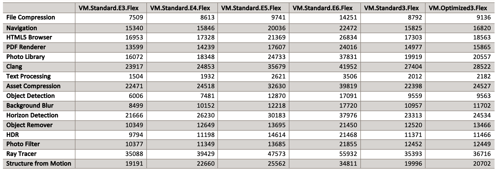

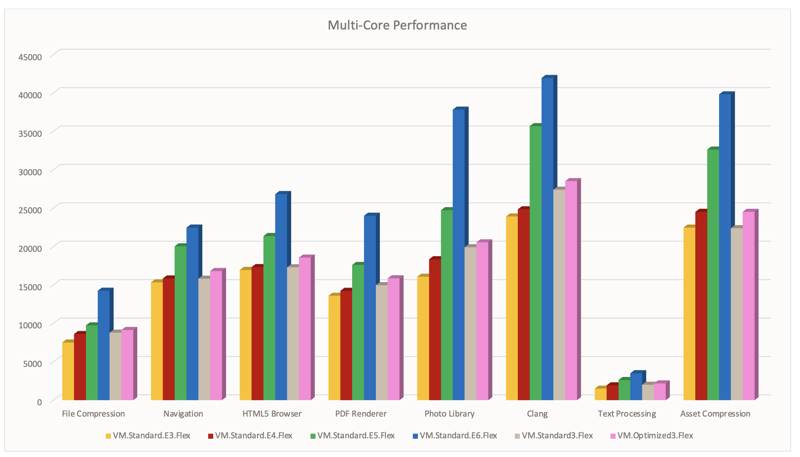

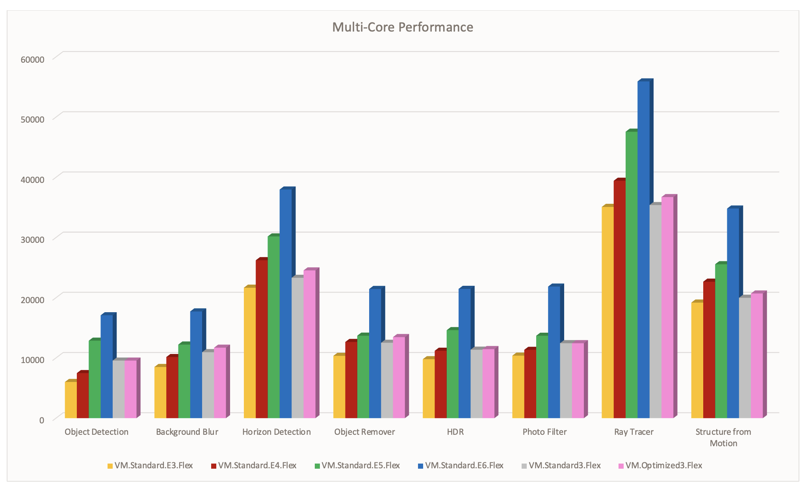

### 4.3	Multi-Core Performance details

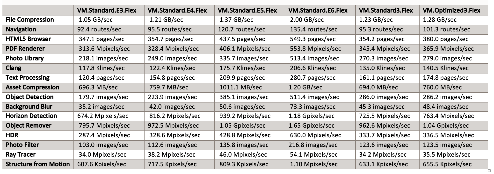

### 4.4	Multi-Core Performance Analysis

Multi-core performance exhibits the most pronounced generational gains across all evaluated OCI shapes. 
The VM.Standard.E6.Flex achieves a score of 23,171, representing nearly a 2× performance increase compared to E3, and a substantial uplift over E4 and E5.

This progression reflects not only an increase in raw compute capacity but also significant improvements in parallel execution efficiency and system-level architecture.

**Key Performance Drivers**

- Enhanced parallel execution efficiency, driven by improved CPU core design and scheduling 
- Higher memory bandwidth and throughput, enabled by the transition to DDR5 in E5 and E6 
- Improved core scalability, allowing better utilization of multi-threaded workloads 
- Architectural optimizations in newer EPYC generations (Genoa → Turin), reducing bottlenecks in concurrent processing

**Parallel Workload Analysis**

A breakdown of workload categories highlights how different types of applications benefit from these multi-core improvements:

**Highly Parallel Compute Workloads**

These workloads scale efficiently with core count and benefit directly from increased parallelism:

- **Rendering** (e.g., ray tracing) 
- **Code compilation** (Clang) 
- **Compression and decompression **

E6 demonstrates significant acceleration in these areas due to its ability to sustain high throughput across all cores.

**AI / Machine Learning Workloads**

Workloads involving vectorized operations and data parallelism show substantial gains:

- Object detection 
- Background blur and image segmentation 

These improvements are driven by better SIMD execution, cache efficiency, and memory bandwidth.

**Data-Intensive Workloads**

Applications that process large volumes of data benefit from both compute and memory subsystem enhancements:

- **PDF rendering **
- **Image processing and transformation **
- **Photo library management**

The transition to DDR5 plays a critical role here, reducing memory bottlenecks and improving overall throughput.

**Notable Performance Gains (E6 vs E3)**

- **Photo library processing:** ~+135% 
- **Object detection**: ~+180% 
- **Ray tracing**: ~+60% 

These gains illustrate that improvements are not limited to synthetic benchmarks but extend** **to real-world, production-relevant workloads.**

**Workload Implications**

The strong multi-core scaling of E6 makes it particularly well-suited for:

- **High-performance computing (HPC) and batch processing **
- **CI/CD pipelines and large-scale code compilation **
- **Media processing and rendering workloads** 
- **AI/ML inference at scale **
- **Data analytics and transformation pipelines**

The E6 generation significantly improves not only raw multi-core performance but also **efficiency in scaling workloads across cores**, making it the optimal choice for modern distributed systems and compute-intensive enterprise applications.

## 5	Performance per Cost Analysis

Evaluating performance in isolation provides only a partial view; a more relevant metric for architectural decision-making is **performance normalized by cost**. 

This approach highlights the true economic efficiency of each compute shape.

When analyzing the ratio of benchmark performance to price (OCPU and memory combined), clear positioning emerges across the different generations:

- **E4 shapes deliver the highest cost efficiency** for budget-constrained environments. They provide a strong balance between price and performance, making them particularly attractive for steady-state, general-purpose workloads. 
- **E5 and E6 shapes deliver the highest absolute performance,** with E6 leading across all benchmark categories. Although their cost per OCPU is slightly higher, the performance gains significantly outweigh the pricing increase, resulting in competitive, if not superior, efficiency for demanding workloads. 
- **Intel-based shapes exhibit lower performance-per-cost ratios** in most scenarios, as their higher pricing is not consistently offset by proportional performance gains. Their relevance remains limited to niche use cases requiring very high per-core frequency.

### 5.1 Comparative Positioning

**Best budget efficiency:**

- **E4** is optimal for cost-sensitive deployments with solid, predictable performance 

**Best absolute performance:**

- **E6** is ideal for compute-intensive, scalable, and high-throughput workloads 

**Best overall balance (price vs performance):**

- **E5** is strong middle ground, combining modern architecture benefits with controlled cost increase

The analysis confirms that** newer AMD EPYC generations not only improve raw performance but also maintain strong economic efficiency**, particularly when evaluated against real-world workloads. As a result, organizations can confidently adopt newer shapes (E5/E6) without compromising cost-effectiveness, especially in environments where performance directly impacts scalability, latency, or throughput.

## 6	Impact of Memory Technology : DDR4 vs DDR5

The transition from **DDR4 (E3/E4) to DDR5 (E5/E6)** represents a major architectural advancement and is a key contributor to the performance gains observed in newer OCI compute shapes. While CPU improvements play a central role, memory subsystem evolution is critical in unlocking the full potential of modern multi-core processors.

### 6.1 Bandwidth and Throughput Improvements

- DDR4-based systems operate at **~3200 MT/s**, whereas DDR5 in E5/E6 reaches up to** 5600 MT/s**, representing a **~75% increase in theoretical memory bandwidth.** 
- This increase directly enhances data transfer rates between memory and CPU, reducing bottlenecks in data-intensive operations. 

### 6.2 Real-World Performance Impact

The benefits of DDR5 are particularly evident in workloads that are sensitive to memory throughput:

- **Asset Compression (multi-core):** E6 achieves ~1.20 GB/sec, compared to ~760 MB/sec on E4, illustrating a substantial gain driven not only by CPU improvements but also by higher memory bandwidth. 
- **Data-heavy processing tasks** such as image manipulation, rendering, and large dataset transformations consistently show improved scaling on DDR5-based systems. 

### 6.3	Improved Compute Efficiency (“Computational Fluidity”)

Higher memory bandwidth significantly reduces the likelihood of CPU cores being **memory-bound**. In previous generations, cores could remain underutilized while waiting for data (a condition often referred to as memory starvation).
  

With DDR5:

- Data is delivered faster to execution units 
- Pipeline stalls are reduced 
- Overall compute efficiency and core utilization increase, especially in multi-threaded scenarios 

This effect is clearly visible in complex workloads such as:

- **Structure from Motion**: reaching ~1.10 Mpixels/sec on E6, significantly outperforming DDR4-based generations 
- Other parallel workloads where sustained data flow is critical to maintaining performance scaling 

### Achitectural Implications

The introduction of DDR5 fundamentally shifts the performance profile of modern compute shapes:

- Enables better scaling across high core counts 
- Enhances performance consistency under heavy load 
- Amplifies the benefits of newer CPU architectures (Genoa and Turin) 

While CPU evolution drives baseline performance improvements,**DDR5 acts as a critical enabler**, ensuring that increased compute capacity is effectively utilized. For memory-bound and data-intensive workloads, the transition to DDR5 is not incremental, it is **transformational**, and a primary factor behind the superior performance observed in E5 and especially E6 shapes.

## 7	Recommended Use-Cases by Architecture

Based on the detailed performance metrics, we can categorize these shapes into specific workload “sweet spots”:

### 7.1 High-Performance Computing (HPC) & AI

- **Top Choice: VM.Standard.E6.Flex**
- **Reasoning**: Dominates in Object Detection (83.8 images/sec single-core) and Ray Tracing (54.1 Mpixels/sec multi-core).
- **Benefit:** The jump to DDR5 5600 MT/s memory provides the necessary bandwidth for data-heavy AI and rendering tasks.

### 7.2	Web Servers & Application Hosting

- **Top Choice: VM.Standard.E5.Flex**
- **Reasoning**: Offers a significant performance boost over E4 (e.g., 41.4 vs 32.5 pages/sec in HTML5 Browser testing) without reaching the highest price tier of the E6.

### 7.3	Legacy & Stability-First Workloads

- **Top Choice: VM.Standard3.Flex (Intel)**
- **Reasoning**: While it has a lower efficiency rating, the Intel Ice Lake-SP architecture is a known quantity for enterprise applications specifically optimized for Intel Instruction Sets (AVX-512).

### 7.4	Key Findings

- AMD dominates in price/performance 
- E6 is a major leap forward 
- DDR5 impact is significant 
- Intel remains niche for high-frequency workloads 

## 8	Cost Analysis

The pricing model across the evaluated OCI compute shapes reveals a clear differentiation between AMD EPYC-based instances and Intel Xeon-based offerings, both in absolute cost and cost efficiency.

- **AMD-based shapes provide a significantly lower cost per OCPU,** typically ranging from ~25% to 50% less than comparable Intel shapes, positioning them as the most cost-effective option for the majority of workloads. 
- **Memory pricing remains largely consistent across generations,** with a slight increase observed for DDR5-based shapes (E5 and E6), reflecting the higher bandwidth and improved performance characteristics of next-generation memory. 
- **The incremental cost increase from E4 to E5/E6 is moderate** and primarily driven by newer CPU architectures and memory technologies. 

From a value perspective, this pricing evolution is justified, and even advantageous. The performance improvements delivered by E5 and especially E6 (in both single-core and multi-core scenarios) significantly exceed the relative increase in cost. As a result, these newer generations achieve **superior performance-per-euro ratios**, particularly for compute-intensive and scalable workloads.

In contrast, Intel-based shapes exhibit higher baseline pricing without delivering proportional performance gains in most benchmark categories. While they may retain relevance for specific high-frequency or latency-sensitive use cases, their overall cost efficiency is generally lower compared to AMD-based alternatives.

When normalized against performance, AMD EPYC shapes, especially from the E4 generation onward, consistently deliver **the best balance between cost, scalability, and computational throughput**, making them the preferred choice for most enterprise workloads.

## 9 Conclusion

This benchmark highlights the rapid and consistent evolution of AMD EPYC processors within Oracle Cloud Infrastructure, with each generation delivering s**ubstantial gains in both raw performance and operational efficiency**. The progression from Rome (E3) to Turin (E6) is not incremental but transformational, driven by architectural improvements, higher frequencies, increased core efficiency, and the adoption of DDR5 memory.

The results clearly demonstrate that **performance scaling across generations is predictable and significant**, enabling organizations to align infrastructure choices with workload requirements and business priorities.

**From a decision-making perspective:**

- **E4** remains a highly attractive option for **cost-sensitive environments**, offering strong and stable performance with excellent price efficiency. 
- **E5** provides the **best overall balance**, combining modern architecture (DDR5, improved IPC) with controlled cost increases, making it ideal for most general-purpose and scalable workloads. 
- **E6** stands out as the **premium performance tier,** delivering industry-leading results in both single-core and multi-core scenarios, and should be prioritized **for performance-critical, compute-intensive, or latency-sensitive applications. **

In comparison, **Intel-based shapes maintain niche relevance** for specific high-frequency use cases but do not provide the same level of cost efficiency or scalability across diverse workloads.

The study confirms that adopting newer AMD EPYC generations, particularly E5 and E6, enables organizations to **maximize performance without compromising cost efficiency,** while also future-proofing their infrastructure for increasingly parallel, data-intensive, and latency-sensitive workloads.

